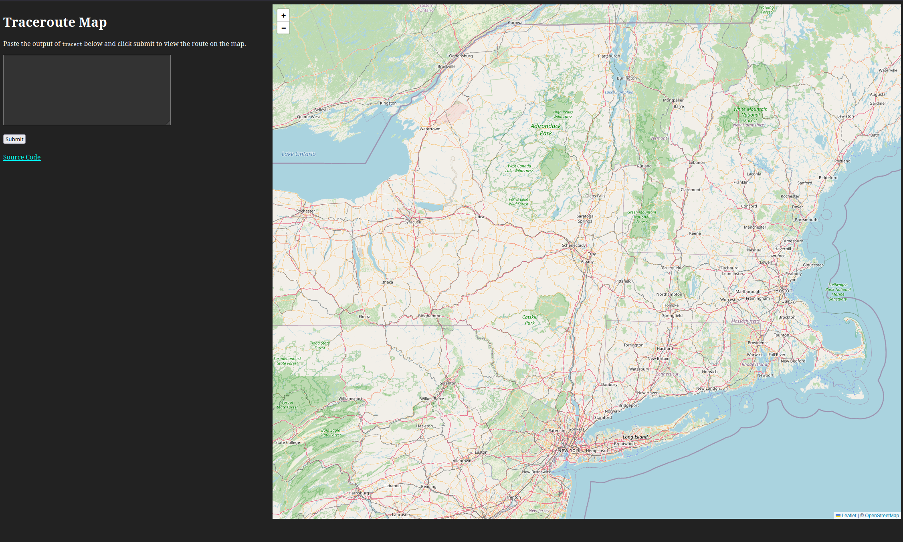

# tracert map

A small website that parses the output of the `tracert` or `traceroute` command
and displays it on an [openstreetmap](https://www.openstreetmap.org/)



## Setup

1. Create an ipinfo.io account and generate an access token

2. Place the access token in a config.toml file

```toml
// config.toml
token = "put token here"
```

3. Run the server

```bash
cargo run --release -- -c config.toml
```

## Design

This server is written in [Rust](https://www.rust-lang.org/). It uses the [axum](https://crate.io/crates/axum) web framework and using [leaflet](https://leafletjs.com/) + [openstreetmap](https://www.openstreetmap.org/) for the map.

It was created in less than 2 days of work.
