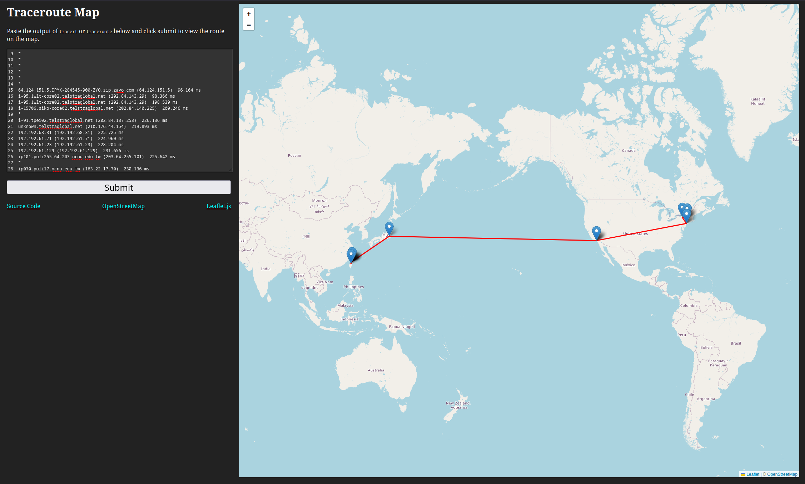

# tracert map

A small website that parses the output of the `tracert` or `traceroute` command
and displays it on an [openstreetmap](https://www.openstreetmap.org/)



## Setup

1. Create an ipinfo.io account and generate an access token

2. Place the access token in a `config.toml`` file

```toml
token = "put token here"
```

3. Run the server

```bash
cargo run --release -- -c config.toml
```

4. Optionally, you can use a docker container

```sh
docker run -v ./config.toml:/app/config.toml -p 4460:80 alextopher/tracert-map:latest
```

## Design

This server is written in [Rust](https://www.rust-lang.org/). It uses the [axum](https://crate.io/crates/axum) web framework and using [leaflet](https://leafletjs.com/) + [openstreetmap](https://www.openstreetmap.org/) for the map.

This project was created in less than 2 days of work.
